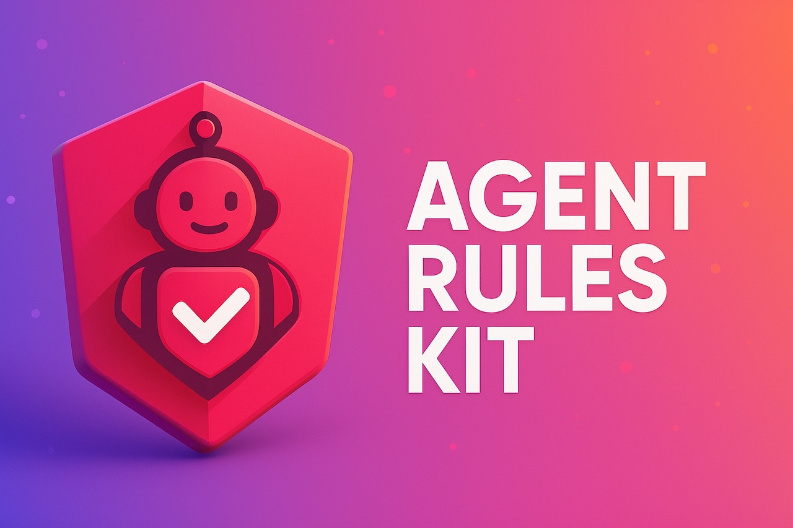

# Agent Rules Kit

<p align="center">
  
</p>

> Bootstrap of **Cursor** rules (`.mdc`) and mirror documentation (`.md`) for AI agent-guided projects.

## What is Agent Rules Kit?

Agent Rules Kit is a CLI tool that facilitates the installation and configuration of rules for Cursor AI, the AI-powered IDE. The rules help AI agents better understand the structure, patterns, and best practices of different technology stacks.

## Main Features

-   🚀 Quick setup of rules for different frameworks and stacks
-   🔍 Automatic framework version detection
-   🏗️ Support for multiple architectural styles
-   📚 Mirror documentation generation for human reference
-   🧩 Modular system for easy expansion to new frameworks

## Supported Stacks

-   Laravel (v8-12)
-   Next.js (v12-14)
-   React (v17-18)
-   Angular (v14-17)
-   NestJS
-   Astro
-   Generic (for any project)

## Implementation Status

<p align="center">

| Stack                                                                                                                                 | Status                              | Features                                                    |
| ------------------------------------------------------------------------------------------------------------------------------------- | ----------------------------------- | ----------------------------------------------------------- |
|    |  | Multiple architectures, version detection, casting rules    |
|  |  | App & Pages router support, version detection, testing docs |
|    |  | Signals support, base project structure                     |
|       |  | Base project structure, patterns documentation              |
|          |  | Testing guidelines, architecture concepts, best practices   |
|             |  | Testing guidelines, architecture concepts                   |
|          |  | Testing guidelines, architecture concepts                   |
|          |  | Basic configuration                                         |
|     |  | Best practices, file operations, code standards             |

</p>

## Installation

### Option 1: Run directly (Recommended)

No installation needed, run directly with:

```bash
npx agent-rules-kit
# or
pnpx agent-rules-kit
```

This will execute the latest version from npm without installing it globally.

### Option 2: Global installation

```bash
npm install -g agent-rules-kit
# Then run
agent-rules-kit
```

### Option 3: Development/Contribution

```bash
git clone https://github.com/tecnomanu/agent-rules-kit.git
cd agent-rules-kit
npm install
npm start
```

## Basic Usage

Run the command in your project root:

```bash
npx agent-rules-kit
```

Follow the interactive instructions to select the stack, architecture, and other options.

### Available Options

-   **Stack Selection**: Choose the main framework or technology for your project
-   **Global Rules**: Include general best practice rules
-   **Cursor Directory**: Specify the location of the Cursor directory
-   **Project Path**: Define the relative path if the project is not in the root
-   **Mirror Documentation**: Generate .md files that reflect the rules for human reference

### Supported Architectures (Laravel)

-   **Standard**: Traditional MVC structure with Repositories
-   **DDD (Domain-Driven Design)**: Business domain organization
-   **Hexagonal**: Ports and adapters architecture

### Router Modes (Next.js)

-   **App Router**: For Next.js 13+ projects
-   **Pages Router**: Traditional router
-   **Hybrid**: Both router types

## File Structure

Rules are installed in:

```
.cursor/rules/rules-kit/
├── global/     # Global best practice rules
└── [stack]/    # Stack-specific rules
```

Mirror documentation is generated in:

```
docs/
├── global/
└── [stack]/
```

## Advanced Configuration

### Template Files

Templates for all stacks are located in:

```
templates/
├── global/              # Global rules
└── stacks/
    ├── laravel/
    │   ├── base/        # Laravel base rules
    │   ├── v8-9/        # Laravel 8-9 specific rules
    │   ├── v10-11/      # Laravel 10-11 specific rules
    │   └── v12/         # Laravel 12 specific rules
    ├── nextjs/
    │   └── ...
    └── ...
```

### Kit Configuration

The main configuration is in `templates/kit-config.json`, where it defines:

-   Version ranges for each stack
-   File patterns for specific rules
-   Architecture configurations

## Development

### Prerequisites

-   Node.js 14+
-   npm or pnpm

### Development Installation

```bash
git clone https://github.com/tecnomanu/agent-rules-kit.git
cd agent-rules-kit
npm install
```

### Available Commands

```bash
npm start           # Run the CLI
npm test            # Run tests
npm run test -- --update  # Update snapshots
```

## License

ISC
